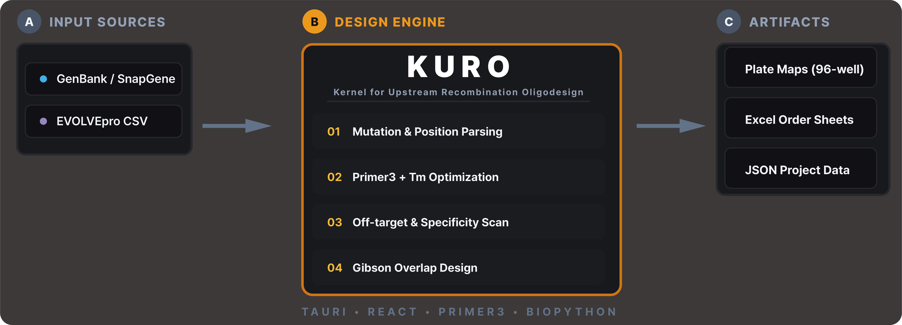

# kuma — 프라이머 설계(Kuro) + NGS 검증(Mame)

**한국어** | [English](README.md)

`kuma`는 두 서브툴을 하나의 Tauri 데스크톱 앱으로 묶는다:

- **Kuro** — *Kernel for Upstream Recombination Oligodesign.* Gibson Assembly 기반 SDM 프라이머 일괄 설계.
- **Mame** — *Mutagenesis Assessment & Microplate Export.* Oxford Nanopore NGS 판정. 어떤 클론이 의도한 돌연변이를 가졌는지 검증.

Kuro 탭에서 프라이머를 설계하고 실험·시퀀싱 후 Mame 탭으로 넘어가 의도한 돌연변이가 제대로 들어갔는지 판정한다.



프로젝트 폴더로 Kuro 설계 결과와 Mame 검증 결과를 연결해, 올리고 주문부터 시퀀싱 판독까지 수 주의 시간차가 있어도 작업이 이어진다. Kuro가 내보내는 xlsx에 숨김 시트 `__kuma_meta__`를 삽입해, 나중에 Mame에서 파일을 드롭만 해도 출처 프로젝트를 자동 인식한다.

---

## 탭 구성

### Kuro — SDM 프라이머 설계

변이 목록(텍스트 / EVOLVEpro CSV)과 템플릿 시퀀스(GenBank / SnapGene)를 입력하면, overlap extension 방식의 SDM 프라이머 쌍을 자동 설계한다.

- **EVOLVEpro CSV 입력**: EVOLVEpro(`variant`, `y_pred`) 출력 CSV 로드. 점수 내림차순 정렬 후 설정 개수만큼 자동 선정. **위치 다양성** 필터로 아미노산 위치당 최대 N개 제한 가능 (동일 위치 후보 점수 차이 2% 이내 시 Grantham 1974 거리가 낮은 보수적 치환 우선). **도메인 다양성** 필터로 단백질 구조 도메인 간 분산 선택 (InterPro/Pfam 자동 조회 또는 수동 입력). **Pareto 다양성** 으로 MODIFY 방식의 위치 분산 최대화. **σ-Adaptive Pool**: EVOLVEpro Round와 Round size 입력 시 누적 데이터 기반으로 후보 풀 범위와 entropy 가중치 자동 보정 (K = 0.50→0.25, entropy = 0.30→0.15, Round 1→5+)
- **배치 변이 파싱**: `Q232A` 형식의 변이 목록 → 코돈 위치 자동 계산 + WT 코돈 검증
- **코돈 전략 선택**: Min. changes (WT 대비 최소 염기 변이) 또는 Optimal (E. coli 최적 코돈)
- **Overlap upstream 설계**: overlap 영역이 mutation codon 바로 앞(upstream)에 위치 (EVOLVEpro 방식)
- **Polymerase 프로파일**: 8종 내장 (Benchling, Taq, Phusion, Q5, Q5 SDM, KOD, DreamTaq, TAKARA_GXL). 각 프로파일은 제조사 매뉴얼 기준 Tm 방법·염 농도·DNA 농도·GC 범위 보정. Custom Polymerase 다이얼로그로 사용자 정의 프로파일을 만들면 `~/.kuma/kuro/custom_polymerases.json`에 영구 저장됨
- **Tm 계산**: SantaLucia 1998 nearest-neighbor 모델. 염/DNA/divalent 농도는 선택한 polymerase 프로파일에 따라 달라짐. 기본 Tm 타겟 Fwd 62°C, Rev 58°C, Overlap 42°C
- **점진적 Tm tolerance**: Fwd/Rev 각각 ±0.5°C부터 시작, ±0.5씩 독립 확장 (최대 ±3.0°C)
- **GC% 범위**: 기본 40-60%. 범위 밖 프라이머에 패널티 부여
- **프라이머 길이 제한**: Fwd/Rev min/max 길이 제약 (선택적)
- **Hairpin / Homodimer 검증**: primer3 calc_hairpin/calc_homodimer. Tm, dG(kcal/mol) 표시
- **AlphaFold 3D 거리**: Pareto 다양성이 1차원 위치 거리가 아닌 AlphaFold DB 예측 구조의 실제 Cα 유클리드 거리 사용. UniProt accession 입력 후 자동 조회, `~/.kuma/kuro/embeddings/{accession}_ca.json`에 캐싱
- **Benchmark framework**: Kuro 선택(Pareto/Domain) vs Random vs Top-N을 fitness landscape에서 비교. 지표: hit rate, mean fitness, position coverage
- **합성 품질 점수**: IDT/Twist 가이드라인 기반 올리고 합성 난이도 평가(0-100). Homopolymer, GC-rich 연속, 디뉴클레오타이드 반복, 극단 GC% 감점
- **Sequence Map**: 접이식 SVG 선형 CDS 맵. 변이 위치, 도메인 영역, 밀도 히스토그램
- **후보 비교 및 교체**: 프라이머 서열 클릭 시 후보 비교 팝오버
- **커스텀 프라이머 평가**: 후보 팝오버에서 직접 서열 입력 → Tm, GC%, hairpin, off-target 즉시 계산
- **실패 돌연변이 재시도**: 실패한 mutation 클릭 → 파라미터 조절 → 재설계. popover 의 **Use suggestion** 버튼은 같은 run 에서 성공한 primer 들의 median Tm, GC/길이 관측 범위, tol ±5°C 를 한 번에 채워줌
- **Tm tolerance 사용자 설정**: Advanced Options 에서 ±°C 직접 지정 (범위 0.5–10.0, step 0.5, 기본 3.0). Cascade rescue 단계는 이 base 값에 delta 추가. 권장 2–5°C
- **Position Rescue**: 모드별 multi-stage cascade.
  - **Top-N + Fill-on-failure ON** → 위치 고정 4-stage 조건완화 (length → +GC → +mild Tm → strong). 배지 `🎯¹` length / `🎯²` +GC / `🎯³` +mild Tm / `🎯⁴` strong
  - **Pipeline + Fill-on-failure ON** → 6-stage: ① 동일 위치 대안 variant (`↻¹`) → ② 다른 위치 substitution (`↻²`) → ③–⑥ 동일 4-stage 완화
  - **Fill-on-failure OFF** → 위치 고정 2-stage 자동재시도 (mild → strong). 성공 primer 들로부터 도출한 파라미터 사용
  - 백엔드의 legacy pool cascade (`↻ cascade`) 와 auto-relax (`⚡ relaxed`) 는 frontend cascade 이전에 자동 적용
  - Stage 카운터 Design Report 에 표시
- **실패 시 자동 채움**: 기본 ON. 켜져 있으면 selection mode 에 따라 위 cascade 발동. OFF 면 2-stage 자동재시도만 실행
- **Off-target 검증**: template sense/antisense에서 비특이적 결합 자동 검출
- **96-well Plate Map**: Fwd/Rev 쌍 연동 플레이트. 96개 초과 시 multi-plate 슬라이드
- **Echo 525 / JANUS export**: 액체 핸들러 매핑 XLSX workbook. Echo는 384-well 소스 레이아웃 + 전송 목록, JANUS는 Fwd/Rev 96-well 래크

### Mame — NGS 스크리닝 판정

Kuro가 만든 `expected_mutations.xlsx`, 참조 FASTA, MAME가 생성한 barcode-mode consensus FASTA들을 입력받아 바코드별 돌연변이 판정과 96-well Final Excel을 만든다.

- **MAME consensus FASTA ingest**: MAME 자체 demux→consensus pipeline의 barcode-mode 출력. Consensus header의 `depth=N`, low-depth 위치, N fraction, mixed-allele metric이 `LOWDEPTH`/`AMBIGUOUS` 판정 근거가 된다.
- **Phred-aware consensus**: raw FASTQ에서 시작하면 read ID와 quality string을 내부 demux 단계에서 보존해 저품질 base call이 consensus vote를 이기지 못하게 한다.
- **6-class 판정**: 각 바코드를 6가지 결과로 분류 (exact match, partial, off-target, WT retained, no coverage, ambiguous)
- **Mixed-well guard**: minor-allele metric이 있는 consensus는 within-well mixture 근거가 충분할 때 다수결 PASS 대신 `AMBIGUOUS`로 표시한다.
- **Explainable QC evidence**: 판정 테이블과 Excel export에 read depth, N fraction, low-depth 위치, low-quality base 제외 수, MAPQ/span drop counter를 표시한다.
- **3-replicate best pick**: 삼중 바코드 중 최고 점수 클론 선택
- **96-well Final Excel**: column-major 96-well 레이아웃에 웰별 판정. Kuro의 plate map 순서와 동기화
- **Single-view 워크벤치**: 입력 파일 패널, 파라미터 패널(mode / CDS end / cutoffs), NB01/NB02/NB03/ALL 필터가 있는 판정 테이블, 색맹 친화 토글이 있는 96-well 맵
- **치환(Substitution) 지원**: Phase 1은 단일 잔기 치환 중심. 결실/삽입은 이후 단계

## 선택 전략 (Kuro, EVOLVEpro 모드)

EVOLVEpro CSV 로드 시 어떤 mutation을 프라이머 설계 대상으로 선정할지 결정. 독립 체크박스로 자유 조합 가능.

| 전략 | 설명 | 사용 시점 |
|------|------|-----------|
| **Top-N by score** | 예측 적합도(y_pred / property_value) 내림차순 상위 N개 선택. N = 최대 프라이머 수 (기본 95). | 기본 랭킹. 예측 적합도만 기준일 때. |
| **Position diversity** | 아미노산 위치당 최대 mutation 수 제한 (기본 1). 동일 위치 두 후보 점수 차이 2% 이내 시 Grantham 1974 거리가 낮은 보수적 치환 우선. 다른 전략 적용 전 사전 필터. | 특정 위치에 mutation이 과도 집중되는 것을 방지. |
| **Domain diversity** | 단백질 구조 도메인별 할당량 배분 (비례 또는 균등). 도메인 정보는 UniProt accession으로 InterPro/Pfam 자동 조회 또는 수동 입력. | 한 도메인이 y_pred 상위를 독점할 때 전 도메인 탐색. |
| **Pareto diversity** | Greedy maximin 위치 선택. 이미 선택된 mutation과 가장 먼 위치를 반복 선택하여 공간적 분산 극대화. | 좁은 영역에 mutation이 밀집되는 것을 방지. MODIFY 접근법(Ding et al., *Nature Communications*, 2024). |
| **Entropy-guided** (β) | 위치별 y_pred 분포의 Shannon entropy(가중치 0.3)를 Pareto 점수에 혼합. | 적합도 경관에 여러 봉우리가 있을 때 국소 최적 탈출. Pareto 활성화 필요. |

**참고 문헌**
- Ding D, Shaw AY, Sinai S, et al. Protein design using structure-predicted residue preferences and sequence-predicted fitness. *Nature Communications*, 15:6729 (2024). PMID:39080249 — MODIFY: Pareto fitness-diversity 공동 최적화

## 프로젝트 워크플로

첫 실행 시 **프로젝트 루트** 폴더를 묻는다(기본 `~/Documents/kuma`). 이후 모든 프로젝트는 루트 하위에 폴더로 생성된다:

```
<projects_root>/
└── Sample_42/
    ├── kuma.project.json          # 프로젝트 메타 (schema v1)
    ├── design/
    │   ├── workspace.kuro.json    # Kuro workspace (기존 .kuro.json 포맷 그대로)
    │   └── expected_mutations.xlsx # 숨김 __kuma_meta__ 시트 포함
    └── analysis/
        ├── consensus/             # MAME-generated consensus FASTAs
        └── verdict.xlsx           # Mame 출력
```

`stage` 필드(draft / design_complete / analyzing / done)는 파일 존재 여부로 자동 계산된다. 기존 Kuro workspace(`.kuro.json`)를 단일 파일로 여는 Scratch 모드도 계속 지원.

## 설치

[Releases](https://github.com/gyuminlee-repo/kuma/releases)에서 최신 인스톨러 다운로드.

- **Windows**: `kuma_x.x.x_x64-setup.exe` (NSIS)
- **macOS**: `kuma_x.x.x_aarch64.dmg`
- **Linux**: `.deb` + `.AppImage`

### 개발자 — Windows에서는 `pnpm install` 대신 `pnpm setup`

Windows에서 `pnpm install`은 Defender나 IDE 파일 워처가 `node_modules`를 잠가 첫 시도에 `EACCES`/`EBUSY`로 실패할 수 있다. 대신 래퍼 스크립트를 쓴다:

```powershell
pnpm setup
```

`scripts/safe-install.mjs`는 Windows에서 `package-import-method=copy`를 임시 적용(hardlink 락 우회)하고, retryable 에러 발생 시 최대 3회 자동 재시도한다. macOS/Linux에서는 일반 `pnpm install`과 동일한 동작 + 재시도만.

3회 재시도 후에도 실패하면 원인별 해결 가이드를 출력한다(IDE 종료, Defender 예외, `node_modules` 수동 정리 등).

### macOS — 첫 실행 시 Gatekeeper 경고

kuma는 유료 Apple Developer ID 없이 ad-hoc 서명만 적용된다. 첫 실행 시 "확인되지 않은 개발자" 경고가 표시될 수 있다. 만약 **"손상되었기 때문에 열 수 없습니다"** 메시지가 뜨면 다운로드 시 quarantine bit가 붙은 것이므로 한 번만 풀어주면 된다:

```bash
xattr -cr /Applications/kuma.app
```

이어서 Gatekeeper는 다음 중 한 가지 방법으로 우회한다:

1. Finder에서 `kuma.app` 우클릭(Control+클릭) → **열기** → **열기**
2. 시스템 설정 → 개인정보 보호 및 보안 → kuma 항목 → **그래도 열기**

이후 실행부터는 경고 없이 열린다.

## 사용법

**Kuro 탭**
1. **Help → Load Sample Data** 메뉴로 예제 자동 로드. 또는:
2. 시퀀스 파일 로드 (GenBank `.gb` / SnapGene `.dna`)
3. Target Gene 드롭다운에서 타겟 CDS 확인(자동 선택)
4. 변이 입력 (텍스트 / EVOLVEpro CSV)
5. 코돈 전략 선택 (Min. changes / Optimal)
6. *(선택)* Advanced Options에서 Tm, GC%, 길이 조정
7. **Design Primers** 클릭
8. File → Export Excel (현재 프로젝트의 `design/expected_mutations.xlsx`에 `__kuma_meta__` 포함하여 저장)

**Mame 탭** (실험·시퀀싱 후)
1. **Help → Load Sample Data** 메뉴로 예제 자동 로드. 또는:
2. MAME-generated consensus FASTA를 입력 패널에 드롭
3. 참조 FASTA + `expected_mutations.xlsx` (활성 프로젝트가 가지고 있으면 자동 제안)
4. CDS end / mode / cutoffs 설정
5. **Run** → 판정 테이블 + 96-well plate map
6. **Export** → final xlsx

다른 프로젝트가 활성화된 상태에서 Kuro-export xlsx를 Mame 탭에 드롭하면 `__kuma_meta__ → project_id` 매칭으로 "출처 프로젝트로 로드하시겠어요?" 다이얼로그가 뜬다.

## 활성 데이터 통합 (v0.2.7)

KUMA가 ALE 전체 사이클을 연결한다: Kuro가 라운드 N 변이의 프라이머를 설계하고, 실험실에서 변이를 도입하고, NGS 지노타이핑으로 성공한 클론을 확인한 뒤, 활성 측정 데이터를 MAME에서 처리해 단일 "Handoff" 클릭으로 Kuro 라운드 N+1에 피드백한다.

### 사용 흐름

```
1. KURO 설계      →  라운드 N 변이 프라이머 목록
2. 실험실          →  SDM + 발현
3. MAME NGS       →  클론별 지노타입 판정 (6-class)
4. 활성 측정       →  플레이트 리더 / 형광 측정
5. MAME 활성      →  long format CSV 로드; fold_change / log2_fc 계산
6. EVOLVEpro export →  variant + y_pred CSV (다음 라운드 입력)
7. Round Handoff  →  1-click: 라운드 N+1 생성 + EVOLVEpro CSV를 Kuro에 로드
8. 반복            →  Kuro가 업데이트된 점수로 라운드 N+1 설계
```

### Long Format CSV 입력 형식

활성 데이터 로더는 측정값 1개당 행 1줄의 **long format** CSV(또는 Excel)를 기대한다:

| 컬럼 | 타입 | 설명 |
|---|---|---|
| `plate_id` | string | 플레이트 식별자. 예: `P01` |
| `well_id` | string | A01–H12 형식의 웰 주소 |
| `value` | float | 원시 측정값 |
| `replicate_idx` | int | 반복 인덱스 (1-based). 동일 웰 × 동일 index = 1회 측정 |

WT 웰은 `plate_meta.json`에 선언한다:

```json
{
  "plates": [
    { "plate_id": "P01", "wt_wells": ["A01", "A12", "H01", "H12"] }
  ]
}
```

Fold change와 log2_fc는 플레이트별 WT 평균을 기준으로 계산된다. log2_fc 값이 EVOLVEpro `y_pred`에 직접 매핑된다.

### Round 엔티티

각 ALE 라운드는 워크스페이스(schema v0.3)에서 `Round` 엔티티로 추적된다. 라운드는 다음 정보를 가진다:
- `round_n`: 순차 라운드 번호 (1-based)
- `status`: `design` → `sequencing` → `activity` → `exported`
- `plate_meta`: 해당 라운드의 WT 웰 배치
- 해당 라운드의 Kuro workspace와 MAME NGS 결과 경로

**schema v0.2 이하 워크스페이스 파일은 자동 마이그레이션 없음.** v0.2.6 이하에서 업그레이드 전 설계 데이터를 내보낼 것.

### v0.3 xlsx 파이프라인 (v0.2.8+)

실험실 산출물에 직접 대응하는 xlsx reader: `mutants-well position.xlsx`, Agilent GC-FID raw export(standard / rep-batch), EVOLVEpro xlsx. `kuma_core/mame/activity/evolvepro_xlsx.py:detect_format`이 포맷 자동 분기.

`mame.activity.merge_for_evolvepro` (v0.2.9.0)가 EVOLVEpro 내보내기용 병합을 대체: 활성-지노타입 join + `merge_replicates_priority` (authoritative 우선·mismatch 플래그) + 라벨 교체 가드. 응답에 `replicate_stats`·`export_blocked` 노출. 5/12 데모는 기존 `activity.merge`를 그대로 사용하며 v0.3 버튼 "EVOLVEpro용 병합 (v0.3)"이 패널에 병행 배치.

기본 reference 는 `ref_seq` 미전달 시 `fixtures/egfp.fa` 를 BioPython translate 로 자동 로드합니다 (OQ-④ 결정, v0.9.9.9). 레거시 IspS 라운드용 `fixtures/ispS.fa` (Populus alba ispS CDS, AB198180.1) 도 보존됩니다. UI 추가 배선 불필요.

---

## 아키텍처

Tauri v2 + React 19 shell과 두 개의 Python sidecar (kuro-sidecar, mame-sidecar). 탭 첫 활성화 시 lazy spawn. Rust가 프로젝트 CRUD, config, sidecar 생명주기를 소유. 두 sidecar 모두 `kuma_core.shared` 공통 유틸 공유 — config 경로, 로깅, JSON-RPC 에러 포맷, `kuma_core.shared.sidecar` 헬퍼(`JsonRpcWriter`, bounded crash-log append, private config 디렉토리, path validation).

```
+-------------------------+
| Tauri shell (React)     |
| ├─ Home / Onboarding    |
| └─ MainShell [Kuro|Mame]|
+-------------------------+
       ↓ sidecar_rpc(kind, method, params)
+----------------+   +----------------+
| kuro-sidecar   |   | mame-sidecar   |
| (PyInstaller)  |   | (PyInstaller)  |
+----------------+   +----------------+
```

## 공통 프론트엔드 헌장 (Common Frontend Standards)

Kuro·Mame 는 `docs/standards/common-frontend-standards.md` (v1.1 stable) 의 22 카테고리를 따른다 — 복구, 관측성, 입력 검증, 에러 UX, 결과 영속성, 설정, UI 안전, 접근성, 버전·업데이트, 텔레메트리, 빌드, 재현성(`run.json`), 장시간 작업(잡 큐 + OS 알림 + sleep inhibit), 데이터 무결성(입력/출력 SHA-256, sidecar binary hash, schema dry-run 마이그레이션), 온보딩, 로컬 진단, 크로스플랫폼, 부분 실패, 성능 가드레일, 인용·라이선스, 멀티 워크스페이스, 안전한 종료. PrimerBench 도 Phase A-E 로 동일 헌장을 적용한다.

## 라이선스

[GPL v2](LICENSE)
