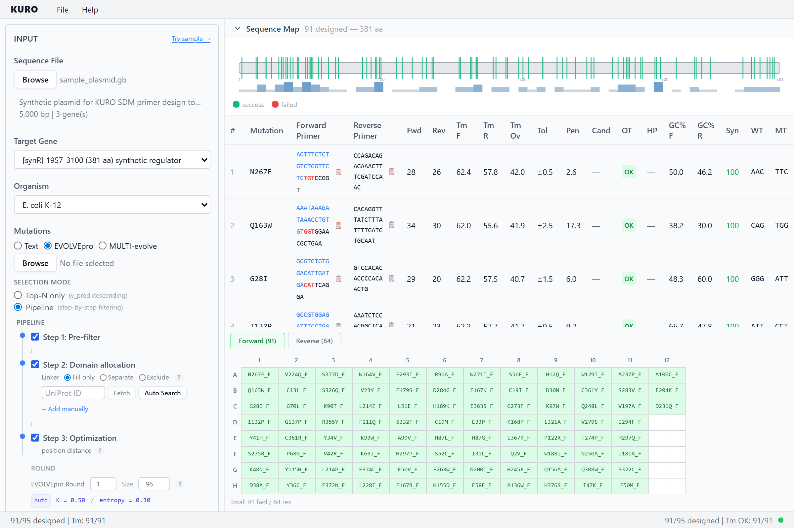

# KURO 사용 가이드


**한국어** | [English](USER-GUIDE.md)
Site-Directed Mutagenesis (SDM) 프라이머 배치 설계 데스크톱 앱.
변이 목록(텍스트/EVOLVEpro CSV)과 템플릿 시퀀스(GenBank/SnapGene)를 입력하면 overlap extension 방식 SDM 프라이머 쌍을 자동 설계한다.

---

## 1. 빠른 시작

### 사전 요구 사항

| 구분 | 최소 버전 |
|------|-----------|
| Node.js | 18+ |
| Rust | Tauri v2 호환 |
| Python | 3.11+ |

### 개발 모드 실행

```bash
# 의존성 설치
npm install
pip install primer3-py==2.3.0 biopython==1.84 openpyxl==3.1.5

# 개발 서버 (Vite, port 1421)
npm run dev
```

### 배포용 빌드

```bash
# Python 사이드카 바이너리 생성 (PyInstaller)
npm run sidecar:build

# Tauri 앱 + 사이드카 통합 빌드
npm run build:all
```

### 첫 프라이머 설계 (GUI)

1. 앱을 실행하면 사이드카(Python 백엔드)가 자동으로 연결된다. 상태 표시줄에 "Ready"가 나타날 때까지 대기.
2. **Browse** 버튼으로 시퀀스 파일(GenBank .gb / SnapGene .dna)을 불러온다.
3. CDS Start ATG가 자동 선택된다 (가장 긴 ORF 기준). 필요 시 드롭다운에서 변경.
4. 변이 목록을 텍스트로 입력하거나 EVOLVEpro CSV를 로드한다.
5. Codon 전략을 선택한다: Min. changes (WT 대비 최소 변이) 또는 Optimal (E. coli 최적 코돈).
6. Mutations 개수를 설정한다 (기본 95, 96개 초과 시 multi-plate 자동 생성).
7. (선택) Advanced Options에서 Tm 타겟, GC% 범위 조정.
8. **Design Primers** 클릭.
9. 프라이머 테이블이 생성된다. Mutation 컬럼 클릭 시 아미노산 위치 순 정렬 가능.
10. Fwd/Rev 서열을 클릭하면 후보 비교 팝오버가 열린다. HP 컬럼을 클릭하면 hairpin/homodimer 상세 정보를 확인할 수 있다.
11. File 메뉴에서 Export Excel / Save Workspace로 내보내거나 세션을 저장한다.


---

## 2. FASTA 파일 준비

### 형식 요구 사항

- Single record FASTA (레코드 1개만 포함)
- 대문자 서열 권장 (소문자도 내부에서 자동 변환됨)
- 플라스미드 전체 서열을 포함해야 한다 (CDS만 별도 추출하지 않음)

```
>pSHCE-dmpR_20160502  (4532 bp)
AAATTCCGGATGAGCATTCATCAGGCGGGCAAGAATGTGAATAAAGGCCGG...
```

### CDS 시작 위치 확인 방법

KURO는 CDS 시작 코돈(ATG) 위치를 0-based index로 받는다.

**SnapGene에서 확인:**
1. 플라스미드 맵에서 타깃 유전자의 CDS feature를 클릭
2. Feature 정보에서 시작 위치를 확인
3. SnapGene는 1-based이므로, 표시된 값에서 1을 뺀다

**Benchling에서 확인:**
1. Sequence Map에서 타깃 CDS annotation을 선택
2. 시작 위치를 확인하고 1을 뺀다 (Benchling도 1-based)

**텍스트 에디터에서 확인:**
1. FASTA 서열에서 타깃 ATG를 찾는다
2. 서열 첫 염기를 0으로 세어 ATG 위치를 계산한다

KURO는 FASTA 로드 시 서열 내 모든 ATG 위치를 자동 탐색하고, 각 ATG에 대해 downstream ORF 길이를 계산하여 가장 긴 ORF를 가진 ATG를 자동 선택한다.

---

## 3. 변이 입력

### 텍스트 입력

한 줄에 변이 하나씩 입력한다. 형식: `{WT아미노산}{위치}{MT아미노산}`

```
Q232A
Y233A
E335A
E167A
K200A
```

- 아미노산은 1-letter code 대문자
- 위치는 1-based (CDS 첫 메티오닌 = 1)
- 빈 줄은 무시됨

### EVOLVEpro CSV 입력

EVOLVEpro 모드를 선택하고 Browse 버튼으로 EVOLVEpro 출력 CSV를 로드한다.

- `variant`와 `y_pred` 열이 포함된 CSV
- y_pred 내림차순으로 정렬하여 Mutations 설정값만큼 자동 선정 (기본 95개)
- **위치 다양성(Position diversity)** (선택): 체크박스를 활성화하면 아미노산 위치당 최대 N개로 제한. 같은 위치에 고점수 변이가 집중될 때 (예: Q10A, Q10L, Q10V) 위치당 대표만 유지하여 탐색 범위를 다양화
- 로드 후 텍스트 영역에서 직접 편집 가능


---

## 4. 파라미터 설정

### Target Gene

시퀀스 로드 시 CDS 유전자가 자동 감지되어 드롭다운으로 표시된다.

- GenBank 파일: CDS feature에서 유전자명과 위치 자동 추출. `[유전자명] start-end (aa)` 형식
- FASTA 파일: 가장 긴 ORF를 자동 감지. `(ORF1) start-end (aa)` 형식
- 가장 긴 유전자가 자동 선택됨
- 잘못된 유전자 선택 시 WT 아미노산 검증에서 에러 발생

### Codon

변이 코돈 선택 전략을 결정한다.

| 전략 | 설명 |
|------|------|
| **Min. changes** (기본) | WT 코돈 대비 최소 염기 변이 수를 가진 코돈을 우선 선택. 프라이머 내 변이 위치가 적어 합성 정확도에 유리 |
| **Optimal** | E. coli K-12 codon usage frequency가 가장 높은 코돈을 우선 선택. 발현 최적화에 유리 |

두 전략 모두 대안 코돈도 후보로 시도하여 penalty가 낮은 프라이머 쌍을 선택한다.

### Mutations

**최종 성공 개수 목표**를 설정한다 (기본값 95). "Fill on failure" 활성화 시 일부 mutation이 실패하면 다음 순위 후보로 자동 대체하여 목표 수를 채운다. 비활성화 시 정확히 N개만 시도하여 실패 수만큼 적게 반환된다. 96개 초과 시 Plate Map이 multi-plate로 자동 분할되며, ‹ › 버튼으로 plate 간 이동할 수 있다. 각 plate의 Rev는 같은 plate의 Fwd mutation에 대응하는 reverse primer만 포함된다.

### Advanced Options

"Advanced options..." 링크를 클릭하면 접이식 패널이 펼쳐진다. 설정하지 않으면 기본값으로 설계된다.

| 파라미터 | 기본값 | 설명 |
|----------|--------|------|
| Tm Fwd | 62°C | Forward 프라이머 전체 Tm 목표 |
| Tm Rev | 58°C | Reverse 프라이머 전체 Tm 목표 |
| Tm Overlap | 42°C | Overlap 영역 Tm 목표 |
| GC% | 40-60% | GC 함량 허용 범위. 범위 밖 프라이머에 penalty 부여 |
| Primer length limit | Off | 활성화 시 Fwd/Rev min/max 프라이머 길이(bp) 설정 가능. 기본값: Fwd 18-45, Rev 18-30 |
| Fill on failure | On | 일부 mutation 설계 실패 시 다음 순위 mutation으로 자동 대체하여 요청 수 채움 |

Tm 계산은 SantaLucia 1998 모델을 사용하며, 폴리머라제 종류와 무관하게 동일한 계산 조건(mv_conc=50 mM, dna_conc=250 nM)을 적용한다. 프라이머는 한 번 설계되면 어떤 폴리머라제를 사용하든 동일한 서열을 주문하므로, Tm 계산 방법을 폴리머라제별로 변경할 필요가 없다.

---

## 5. 프라이머 테이블과 Tm 조건 해석

### 테이블 열 설명

| 열 | 설명 |
|----|------|
| # | 입력 순서 (EVOLVEpro y_pred 내림차순 기준) |

Forward/Reverse Primer를 제외한 모든 컬럼은 헤더 클릭으로 정렬 가능. 현재 정렬 순서가 Excel plate map export에도 반영된다.
| Mutation | 변이 표기 (예: Q232A). 헤더 클릭 시 aa 위치 순 정렬 |
| Forward Primer | 전체 forward 프라이머 서열. 클릭 시 후보 비교 팝오버 |
| Reverse Primer | 전체 reverse 프라이머 서열. 클릭 시 후보 비교 팝오버 |
| Fwd / Rev | 프라이머 길이 (bp) |
| Tm F / Tm R | 전체 프라이머 Tm |
| Tm Ov | overlap 영역 Tm |
| Tol | 적용된 Tm tolerance (Fwd/Rev 각각 ±값으로 표시) |
| Pen | penalty 점수 (Tm 편차 + GC% 편차 + 코돈 변이 수 + hairpin/homodimer 합산) |
| Cand | 해당 변이의 프라이머 후보 개수. 클릭 시 정렬 가능 |
| OT | Off-target 검출 여부. `!!` 클릭 시 결합 위치·strand·Tm 상세 팝오버 |
| HP | Hairpin/Homodimer worst Tm. 클릭 시 상세 팝오버 (Tm, dG kcal/mol) |
| GC% F / GC% R | 전체 프라이머 GC 함량 (40-60% 범위 권장) |
| WT / MT | 야생형/변이 코돈. MT tooltip은 선택한 코돈 전략에 따라 변경됨 |

### Tm 이중 조건

SDM overlap extension PCR에서 primer-template annealing이 primer-primer annealing보다 강해야 한다.

```
조건: Tm_no_fwd > Tm_overlap + 5  AND  Tm_no_rev > Tm_overlap + 5
```

- **OK (초록)**: 두 non-overlap Tm 모두 overlap Tm보다 5도 이상 높다. 정상 PCR 조건에서 작동할 가능성이 높다.
- **FAIL (빨강)**: 조건 미충족. overlap 영역에서 primer dimer가 형성될 위험이 있다.

### GC 함량

- 권장 범위: 40-60%
- 40% 미만 또는 60% 초과 시 penalty가 부여된다
- 35% 미만 또는 65% 초과 시 경고 메시지가 표시된다

### 경고 메시지

| 경고 | 의미 |
|------|------|
| `Forward primer too long: N bp` | 프라이머 길이가 60 bp 초과. 합성 비용 증가 및 품질 저하 가능 |
| `Reverse primer too long: N bp` | 동일 |
| `Fwd GC% out of range: N%` | Forward 프라이머 GC%가 35% 미만 또는 65% 초과 |
| `Rev GC% out of range: N%` | Reverse 프라이머 GC%가 35% 미만 또는 65% 초과 |
| `Tm condition not met` | Tm 이중 조건 미충족. 다른 폴리머라제 프로필 사용 권장 |
| `Fwd hairpin Tm=X°C (dG=Y kcal/mol)` | Forward 프라이머 hairpin 구조 Tm이 40°C 초과 |
| `Fwd homodimer Tm=X°C (dG=Y kcal/mol)` | Forward 프라이머 homodimer Tm이 40°C 초과 |


---

## 6. 프라이머 후보 비교

Forward 또는 Reverse 서열을 클릭하면 후보 비교 팝오버가 열린다. candidate가 1개뿐이어도 클릭하여 커스텀 프라이머를 입력할 수 있다.

### 비교 항목

후보는 penalty 오름차순으로 정렬된다. #1이 자동 선택된 기본값(best)이며 초록 배경으로 표시된다.

각 후보에 대해 아래 수치를 비교할 수 있다:
- Forward / Reverse 서열 및 길이
- Tm (Fwd, Rev, Overlap)
- GC% (Fwd, Rev)
- Tolerance (Fwd/Rev), Penalty, Off-target

Penalty 셀에 마우스를 올리면 warnings (hairpin, homodimer, GC 등) 세부 항목이 tooltip으로 표시된다.

### 수동 교체

각 후보에 3개 버튼이 표시된다:
- **Both**: Forward + Reverse 모두 교체
- **F**: Forward만 교체 (Reverse는 현재 값 유지)
- **R**: Reverse만 교체 (Forward는 현재 값 유지)

**Reverse 전파**: Reverse를 변경하면 동일 아미노산 위치의 모든 mutation에 자동 전파된다. 같은 위치의 mutation은 동일한 overlap 영역을 공유하므로 reverse primer도 동일해야 한다.

수동 교체된 프라이머는 결과 테이블에서 **amber 배경 하이라이트**로 표시되어 자동 선택과 구분된다.

### 커스텀 프라이머 입력

팝오버 하단에서 Forward 서열을 3파트로 분리 입력한다:
- **Overlap** (파란색 입력): 5' 말단 overlap 영역
- **Codon** (빨간색 입력): 변이 코돈 (3bp)
- **Downstream** (검정 입력): 3' 말단 downstream 영역

Reverse는 단일 입력. **Evaluate** 클릭 시 Tm, GC%, hairpin/homodimer, off-target이 계산되어 보라색 배경 "custom" 행으로 추가된다. 커스텀 후보는 팝오버를 닫아도 유지된다. **Use** 버튼으로 적용하거나 **×** 버튼으로 삭제할 수 있다.

### 실패한 돌연변이 재시도

결과 테이블 아래 Failed 섹션에서 실패한 돌연변이 태그를 클릭하면 팝업이 열린다. 두 가지 복구 방법을 제공한다:

**파라미터 조절 재시도**: Tm 목표, GC% 범위, 프라이머 길이 제한, tolerance 최대값을 조절한 뒤 **Retry** 클릭. 해당 돌연변이만 조절된 파라미터로 재설계하여 최대 10개 후보를 penalty 순으로 표시. **Select** 클릭 시 결과 테이블에 추가.

**수동 입력**: "Or enter manually..." 펼쳐서 Forward (Overlap + Codon + Downstream)와 Reverse 서열을 직접 입력. **Evaluate** 클릭 시 Tm, GC% 등 계산 후 결과에 추가.

---

## 7. 내보내기

### Excel (.xlsx)

File 메뉴 > Export Excel

plate별로 4개 시트가 생성된다. 96개 초과 시 multi-plate로 분리 (Fwd List 1, Fwd Plate 1, Rev List 1, Rev Plate 1, ...). Rev plate는 같은 번호의 Fwd plate에 포함된 mutation에 대응하는 reverse primer만 포함된다 (Fwd-Rev 짝짓기).

각 plate 시트 구성:
1. **Fwd List** 시트: Forward 프라이머 리스트 (Well, Primer Name, Sequence, Length, Tm, Tm_Overlap, WT_Codon, MT_Codon, Mutation). 초록 배경.
2. **Fwd Plate** 시트: Forward 96-well plate 배치 (`mutation_F` 형식). 초록 배경.
3. **Rev List** 시트: Reverse 프라이머 리스트 (중복 제거됨, `_R` 접미사, Fwd List와 동일 컬럼). 주황 배경. 여러 mutation이 공유하는 프라이머는 파란 배경.
4. **Rev Plate** 시트: Reverse 96-well plate 배치 (`mutation_R` 형식). 공유 프라이머 파란 배경.

색상은 프로그램 UI와 동일:
- 초록: Forward 프라이머
- 주황: Reverse 프라이머 (단독)
- 파란: Reverse 프라이머 (여러 mutation 공유)

올리고 합성 업체에 주문할 때 Fwd List / Rev List 시트를 바로 사용할 수 있다.

### Workspace (.kuro.json)

File 메뉴 > Save Workspace

현재 세션 상태를 `.kuro.json` 파일로 저장한다. 저장 항목:
- 시퀀스 파일 경로, 선택된 유전자
- 변이 목록, 입력 모드, 파라미터 (코돈 전략, 폴리머라제, 변이 개수)
- 설계 결과 (프라이머 테이블, 실패 목록, plate map, 정렬 상태)

File 메뉴 > Load Workspace로 저장된 세션을 복원하면 이전 화면이 그대로 표시된다.



### Clear All

사이드바 하단의 **Clear All** 버튼으로 모든 입력과 설계 결과를 초기화할 수 있다.

---

## 8. CLI 사용법

GUI 없이 커맨드라인에서도 동일한 설계 파이프라인을 실행할 수 있다.

### 프라이머 설계

```bash
python -m kuro design \
  --fasta <your_sequence.gb> \
  --target-start <cds_start> \
  --mutations <mutations.csv> \
  --polymerase Q5 \
  --overlap 20 \
  --output results/
```

| 옵션 | 설명 | 기본값 |
|------|------|--------|
| `--fasta` | 템플릿 FASTA 파일 경로 | (필수) |
| `--target-start` | CDS 시작 코돈 0-based 위치 | (필수) |
| `--mutations` | 변이 CSV 파일 경로 (`mutation` 열 필수) | (필수) |
| `--polymerase` | 폴리머라제 프로필 이름 | Q5 |
| `--overlap` | Overlap 길이 (bp) | 20 |
| `--output` | 출력 디렉토리 | results/ |
| `-v` | 상세 로그 출력 | off |

출력 파일:
- `sdm_primers.tsv` — 전체 프라이머 정보
- `plate_mapping.xlsx` — 96-well plate 배치 Excel

### Plate Map 재생성

기존 TSV 파일에서 plate map만 다시 생성할 수 있다.

```bash
python -m kuro plate-map \
  --primers results/sdm_primers.tsv \
  --output results/plate_mapping.xlsx
```

---

## 9. 트러블슈팅

### "expected WT amino acid X at position N, but codon YYY encodes Z"

**원인**: CDS Start 위치가 잘못 지정되어 코돈 프레임이 어긋남.

**해결**:
1. CDS Start 값이 타깃 유전자의 ATG 위치(0-based)와 정확히 일치하는지 확인
2. GUI에서 FASTA를 다시 로드하여 자동 선택된 ATG 목록 확인
3. SnapGene/Benchling에서 CDS annotation 위치를 재확인 (1-based → 0-based 변환 필요)

### Sidecar 연결 실패 (앱 상태가 "error"에 머무는 경우)

**원인**: Python 사이드카 바이너리가 없거나 손상됨.

**해결**:
```bash
# 사이드카 재빌드
npm run sidecar:build

# 재빌드 후 앱 재시작
npm run dev
```

- 사이드카는 최대 5회 자동 재연결을 시도한다 (3초 간격, 점진적 증가)
- Python 의존성(`primer3-py`, `biopython`, `openpyxl`)이 올바르게 설치되어 있는지 확인

### Tm 조건 미충족 (FAIL이 많은 경우)

**원인**: overlap 영역 Tm이 너무 높아 non-overlap Tm과 5도 차이를 확보하지 못함.

**해결**:
1. **Tm 타겟 조정**: Advanced Options에서 Tm Fwd/Rev 타겟을 높이면 non-overlap 길이가 증가하여 overlap Tm과의 차이가 커진다.
2. **후보 비교 활용**: Fwd/Rev 서열 클릭 → 후보 팝오버에서 Tm 조건이 더 나은 대안을 선택하거나 커스텀 프라이머를 입력할 수 있다.
3. GC 함량이 극단적으로 높은 영역에서는 조건 충족이 본질적으로 어렵다.

### "CSV file missing required 'mutation' column"

**원인**: CSV 헤더에 `mutation` 열이 없음.

**해결**: 첫 행에 `mutation`이라는 열 이름이 정확히 포함되어야 한다. 대소문자 구분됨.

---

## 10. 테스트 데이터

프로젝트에 샘플 및 테스트 데이터 파일이 두 디렉토리에 분산되어 있다.

| 파일 | 내용 |
|------|------|
| `samples/sample_plasmid.gb` | 5000 bp 합성 플라스미드 (GenBank). CDS 3개 포함 |
| `samples/sample_evolvepro.csv` | EVOLVEpro 형식 CSV. 120개 variant (y_pred 내림차순) |
| `fixtures/pSHCE-dmpR.fa` | 4532 bp 플라스미드 (FASTA). pytest용 |
| `fixtures/mutation_list_insilico_test.csv` | 12개 alanine scanning 변이. pytest용 |

### 테스트 실행 예시

```bash
# CLI로 전체 파이프라인 실행
python -m kuro design \
  --fasta samples/sample_plasmid.gb \
  --target-start 1957 \
  --mutations samples/sample_evolvepro.csv \
  --polymerase Q5 \
  --overlap 20 \
  --output results/

# pytest 실행 (38 tests)
python -m pytest tests/ -v
```

