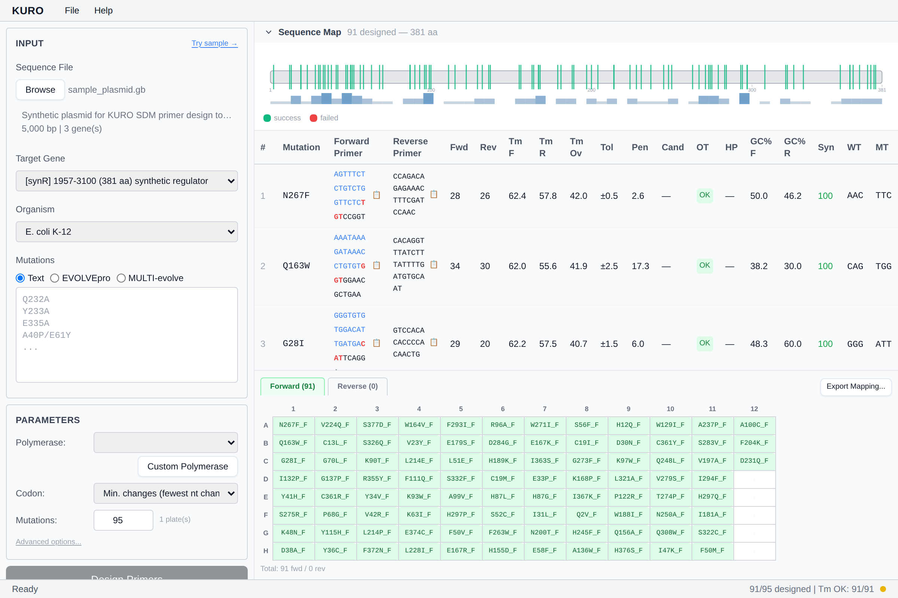

# Candidate Swap

Click a Fwd or Rev sequence cell to open the candidate popover.

## Contents

- **Top 10 alternatives** sorted by rank (Tm deviation × HP ΔG)
- Per-candidate Tm / GC / HP badges
- **Swap** button to replace the current pick

## Swap scope

Pick one of: Forward only / Reverse only / Both (paired). "Both" keeps the Gibson-compatible overlap.

## Custom primer input

Type a free sequence in the custom field. Kuro computes Tm / GC / HP instantly and warns if constraints fail. Submit to override the auto-selected primer.

## Resetting

Click **Reset** in the popover to return to the auto-selected candidate.

*Stub — popover screenshot coming.*
