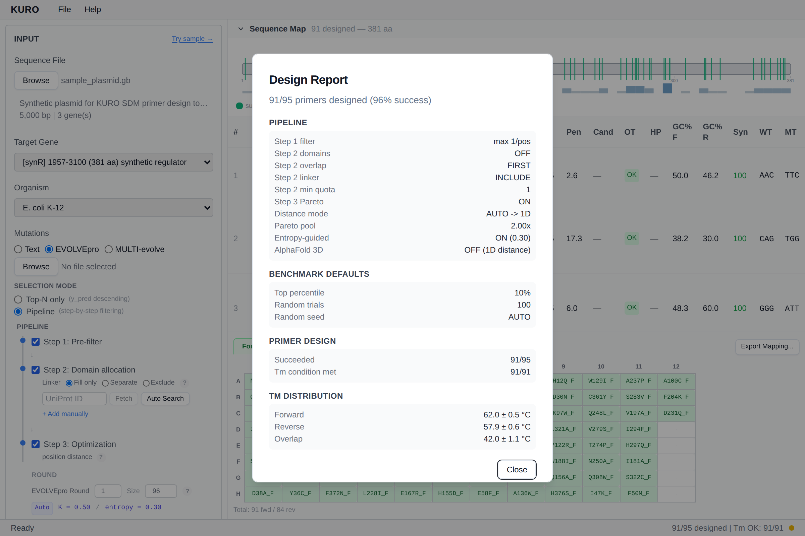

# Design Report

Post-design summary dialog. Opens automatically after a successful run and via Help menu → *Design Report*.

## Sections

1. **Input summary**: sequence name, gene, mutation count, mode (text / EVOLVEpro)
2. **Parameter snapshot** — polymerase, Tm / GC / length, codon strategy
3. **Pipeline stats** (EVOLVEpro modes only) — per-step counts (Step 1 top-N, Step 2 diversity, Step 3 Pareto/entropy)
4. **Domain stats** — picks vs quota per domain
5. **Rescue stats** — count of primers rescued at each tolerance step
6. **Failures** — list of mutations that failed all rescue attempts with reasons

## Use

Gives an auditable record of what the design actually did, useful for lab notebook entries and troubleshooting unexpected plate compositions.

## Echo / Janus mapping preview

Moved out of this dialog in v0.9.9.0. The mapping preview now lives at the top of the **Export** tab in KURO. See the Export tab preview section for source plate, destination plate, and pick list rendering.

*Stub, report screenshot coming.*
