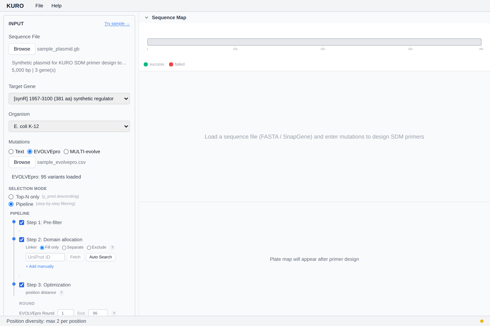
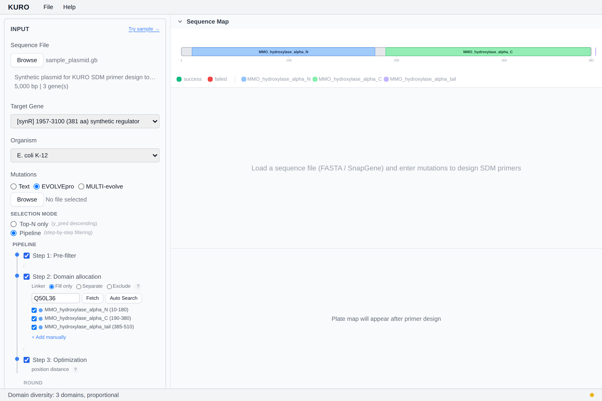

# Diversity Strategies

Available only in EVOLVEpro mode. Strategies stack: enabling multiple combines their filters.

## Position diversity

Caps how many mutations share the same residue position. Prevents over-sampling a single hotspot.

- **max-per-position**: 1 / 2 / 3 (0 = off)

## Domain diversity

Allocates picks across protein domains fetched from InterPro/Pfam via the selected UniProt accession.

- **Strategy**: proportional (by domain size) / equal (same quota each)
- **Overlap policy**: first / largest (when domains overlap)
- **Linker handling**: include / exclude / separate-bin
- **Quota min**: minimum picks per domain (0–20)

Disable specific domains inline; quotas recompute.

## Pareto diversity

Selects on the frontier of predicted fitness × diversity score.

- **Distance mode**: auto / 1d (residue position) / 3d (AlphaFold Cα Euclidean)
- **Pool multiplier**: candidate pool size as a multiple of target count (1–10)

## Entropy weight

Blends per-position Shannon entropy of `y_pred` into the Pareto score. Positions with uncertain predictions get a boost.

- **Weight**: 0.0–1.0 (default 0.3)

## σ-Adaptive pool

Pool size scales with EVOLVEpro round / round-size. Higher round → narrower pool.

*Stub — strategy panels screenshot coming.*
