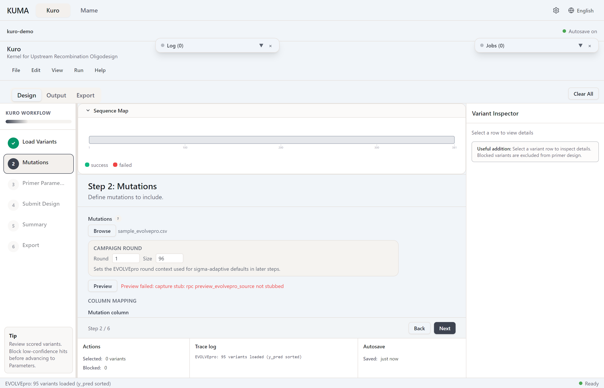

# Entering Mutations



## Text input

One mutation per line. Format: `{WT}{position}{MT}`, all single-letter uppercase.

```
Q232A
Y233A
E335A
```

- Position is 1-based (first Met of CDS = 1)
- Blank lines and `#` comment lines are ignored
- Parse errors are listed inline with line numbers

## EVOLVEpro CSV

Only the variant identifier column is required. Its name is auto-detected from `variant`, `variants`, `mutation`, `mutations`, `mutant`, `mutation_list` (first match wins). The score column is optional and auto-detected from `y_pred`, `property_value`, `predicted_fitness`, `fitness`, `score`, `DMS_score`; rows without a score are read as 0.0, which leaves ranking, Pareto, and diversity selection meaningless but raises no error.

Header matching ignores case, surrounding spaces, and the byte-order mark Excel writes, so `Variant`, `MUTATION`, and `" variant "` all resolve.

When auto-detect misses, pick the columns yourself. The column mapping panel below the file picker lists the headers found in the file; choose the mutation and ranking columns, set the ranking direction, and apply. The panel populates as soon as a file is chosen, so a failed auto-detect does not block the file.

Variant notation accepted:
- Internal form `Q232A` (`{WT}{position}{MT}`)
- EVOLVEpro short form `232A` (position + mutant only) — converted to internal form using the loaded protein sequence as reference. Conversion requires a sequence to be loaded first; otherwise short-form rows pass through unchanged.

Loading a CSV switches the input to **EVOLVEpro mode** — enables ranking by score and exposes diversity controls ([Diversity Strategies](diversity-strategies.md)).

## Max size

Up to 10,000 mutations per run (v1.33.6). Overriding the **Mutations** count below the CSV total trims to the top-N by score.

*Stub — mode screenshots coming.*
