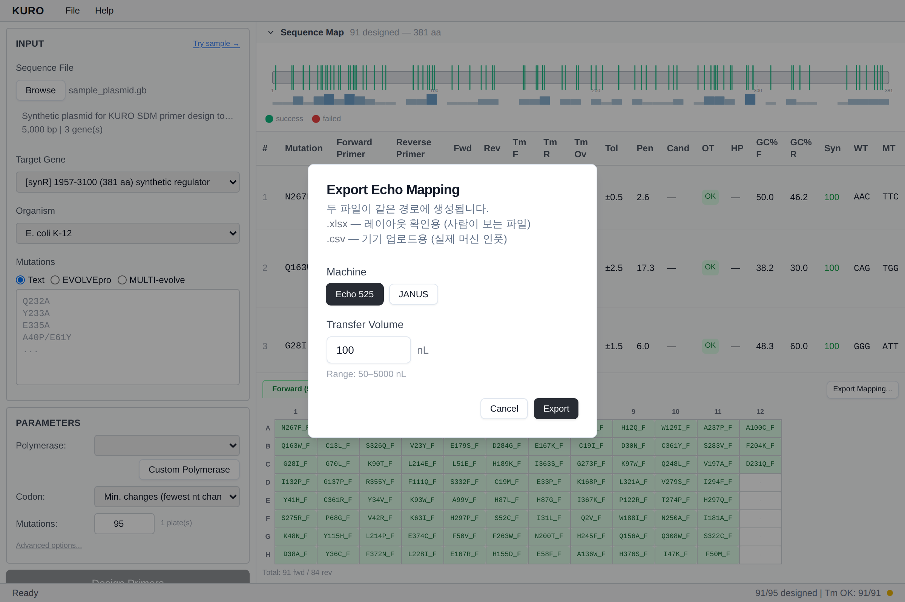

# Export — Liquid Handler Mapping

Mapping files for Echo 525 (acoustic) or JANUS (tip-based) liquid handlers.

## Entry points

- File menu → *Export Echo Mapping…* / *Export JANUS Mapping…*
- **Export Mapping...** button on the Plate Map tab row

Both open the same dialog.

## Dialog fields

| Field | Notes |
|---|---|
| Machine | Echo 525 / JANUS toggle |
| Transfer Volume | Echo: 100 nL default (50–5000 nL); JANUS: 2.0 µL default (0.5–10 µL) |
| File format hint | `.xlsx` = human-readable layout; `.csv` = machine upload |

Both files are written in one save — same directory, same base name.

## Echo 500 nL split

Echo 525 allows ≤500 nL per single acoustic transfer. Volumes above that are auto-split into multiple rows to the same destination well (low-repeat method). 1000 nL → two 500 nL rows; 600 nL → 500 + 100.

## Default filename

`YYMMDD_<gene>_Echo_<Nmut>.xlsx` — see [Export Orders](export-orders.md) for the token cascade.

*Stub — dialog screenshot coming.*
