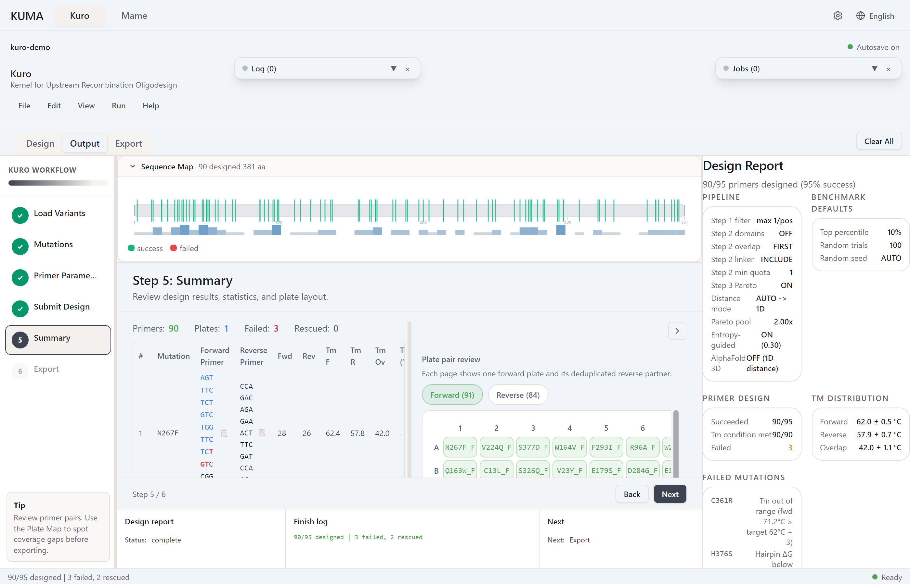

# Failed Retry

When a mutation fails the Tm / GC / length / HP filters, it appears with a red row and a reason (e.g. `Tm out of range`, `hairpin ΔG below threshold`).

## Rescue cascade

Two independent mechanisms run after the first pass fails.

**Auto-relax** re-runs each failed mutation once with a widened window:

- Tm tolerance rises by 2 °C above the value you set, capped at 10 °C
- GC range widens by 5 percentage points on each side, floored at 20 % and capped at 80 %
- Primer length floors drop by 2 nt, never below 15 nt. The upper bounds do not move

GC is scored as a penalty rather than applied as a filter, so widening it changes which candidate ranks first, not whether a candidate exists. Feasibility is decided by the other two, and which of them matters depends on where the primer is stuck.

A primer that has run out of length to give up is the case tolerance cannot solve. Its melting temperature is as low as that position allows, so the only thing a wider window can do is accept it as it stands, hot. Lowering the floor lets the designer shorten instead, which is usually the better answer: the recovered primer anneals with the rest of the plate rather than above it. The choice between the two is made by the same penalty score that ranks every other candidate.

Since v0.16.34 the length floors move. Before that release auto-relax widened Tm and GC only, and a mutation stuck at the length floor had no route to a valid pair.

**Pool cascade** applies only when you supply a rescue pool. For a failed position it tries the backup variants you listed at that same position. A failure caused by the reverse primer cannot be rescued this way: the reverse primer is built from bases upstream of the codon, so it is identical for every variant at that position.

`tol_max` defaults to 4 °C. Auto-relax therefore reaches 6 °C unless you raise the base value first.

Since v0.13.23 auto-relax runs whether or not a rescue pool is present. Earlier versions skipped it entirely when the pool was empty, which is the usual case for manual and CSV input.

## Manual retry

Click **Retry** next to a failed row to re-run with relaxed parameters. Adjust **Tm targets** or **primer length** first for more aggressive recovery.

## Bulk retry

File → *Retry all failed* re-runs every failure with the current parameter state.

*Stub — failed-rows screenshot coming.*
