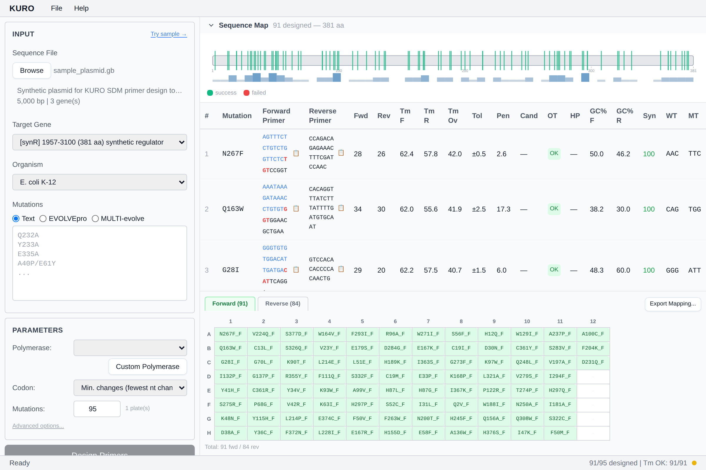

# Interface Overview

Kuro (Kernel for Upstream Recombination Oligodesign) is split into three vertical regions:

1. **Left sidebar (340 px)** — Input panel (sequence, mutations, UniProt/AlphaFold), Parameter panel, Design / Clear buttons
2. **Centre** — Sequence Viewer (top) and Result Table (bottom)
3. **Right** — Plate Map with tab row (Forward / Reverse / plate navigation / Export Mapping)

Top menu bar: File (open/save/export), Help, Benchmark.

Status bar at the bottom shows sidecar state, current action, and progress.

After design completes you can switch to the Mame tab to verify clones.
