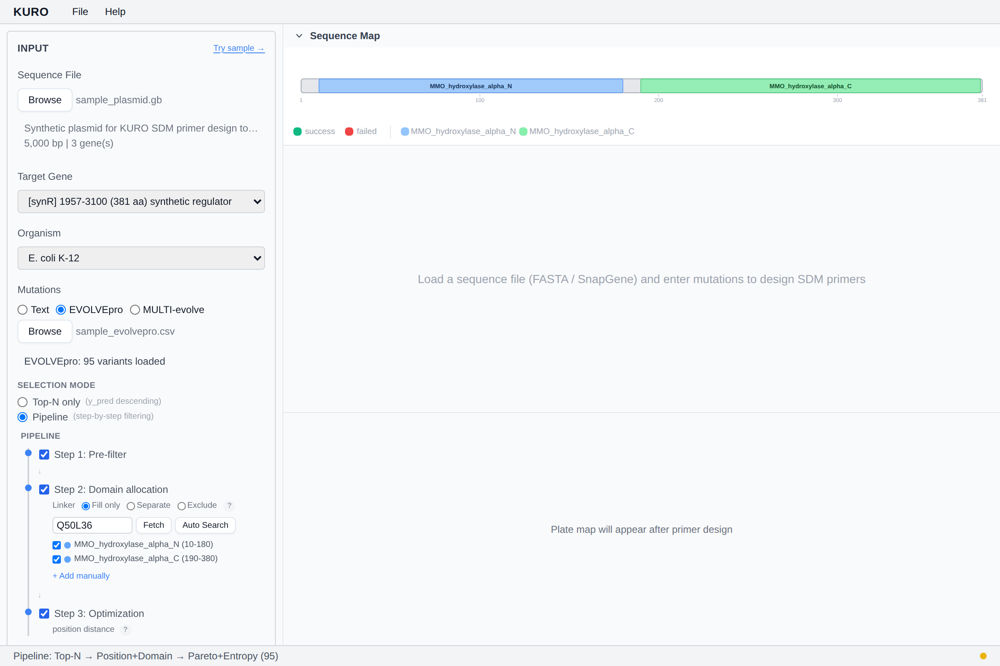

# Pipeline Mode

Pipeline mode chains EVOLVEpro ranking with diversity filters in a 3-step selection.

## When to use

Active automatically when an EVOLVEpro CSV is loaded **and** at least one diversity toggle is on.

## Steps

1. **Top-N by score** — rank all variants by `y_pred`, keep top `target × pool_multiplier`
2. **Domain / position diversity** — apply quotas
3. **Pareto / entropy** — re-score the pool on (fitness, diversity) and keep the final target count

Each step reports counts in the Design Report — see [Design Report](design-report.md).

## Multi-evolve

MULTI-evolve CSVs run the same 3-step pipeline **per target group** (grouped by the `target` column).

*Stub — flowchart coming.*
