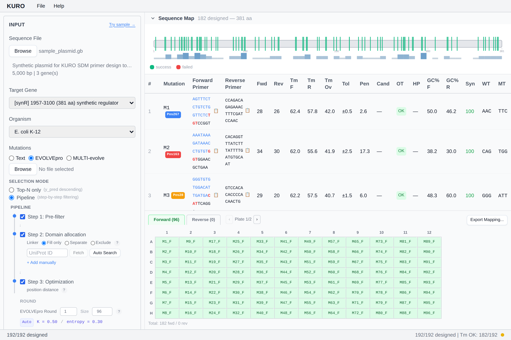

# Plate Map

96-well grid render of the designed primer set. Visible once design completes.

## Tabs

- **Forward** — green grid
- **Reverse** — orange grid, blue-highlighted wells are shared across multiple mutations

## Layout

Well ordering: column-major A1 → H1 → A2 → … Shared reverse primers are deduplicated per plate (placed once, referenced by multiple forward pairs).

## Multi-plate navigation

When the design exceeds 96 mutations, navigation chevrons `‹ Plate N/M ›` appear between the tabs. Each plate is a separate grid.

## Export Mapping

**Export Mapping...** button at the right end opens the export dialog for Echo / JANUS liquid handlers. See [Export Liquid Handler](export-liquid-handler.md).

## Total footer

Below the grid: `Total: N fwd / M rev`. Legend for shared reverse appears only when the Reverse tab is active.

*Stub — single / multi-plate screenshots coming.*
