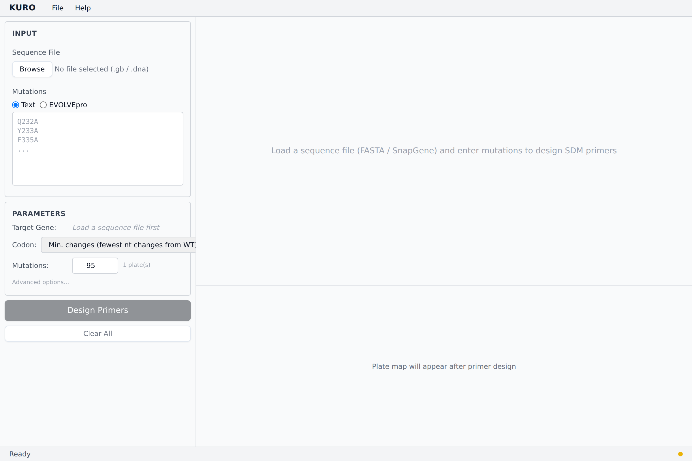
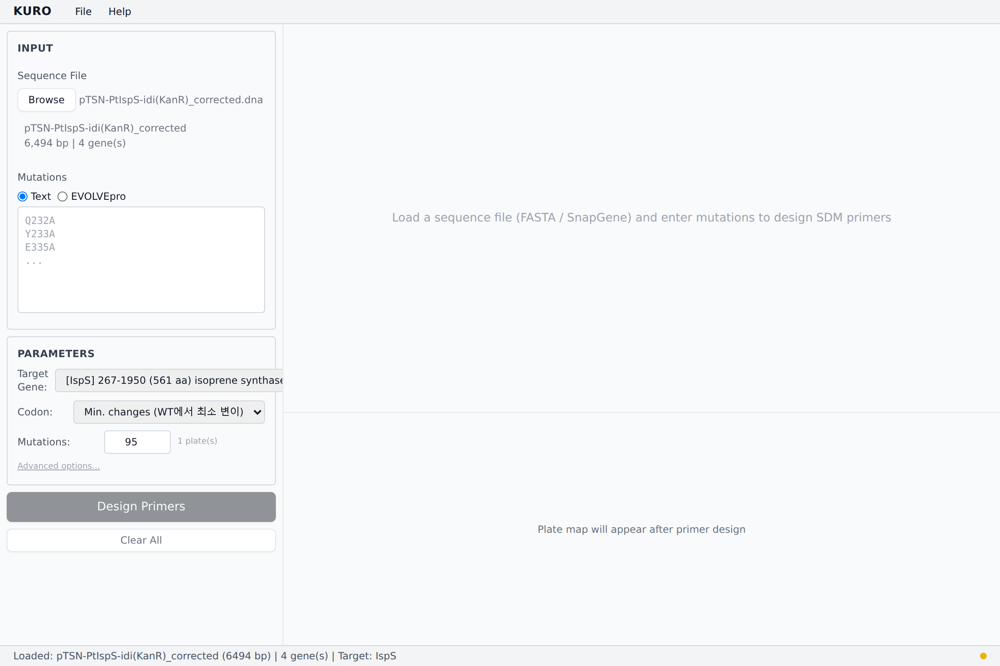
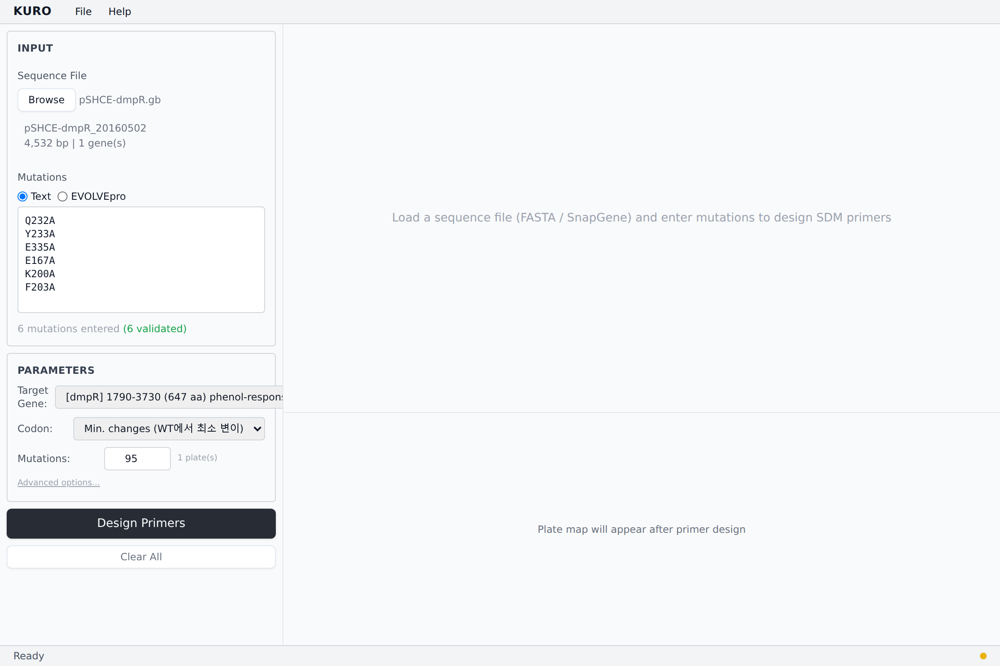
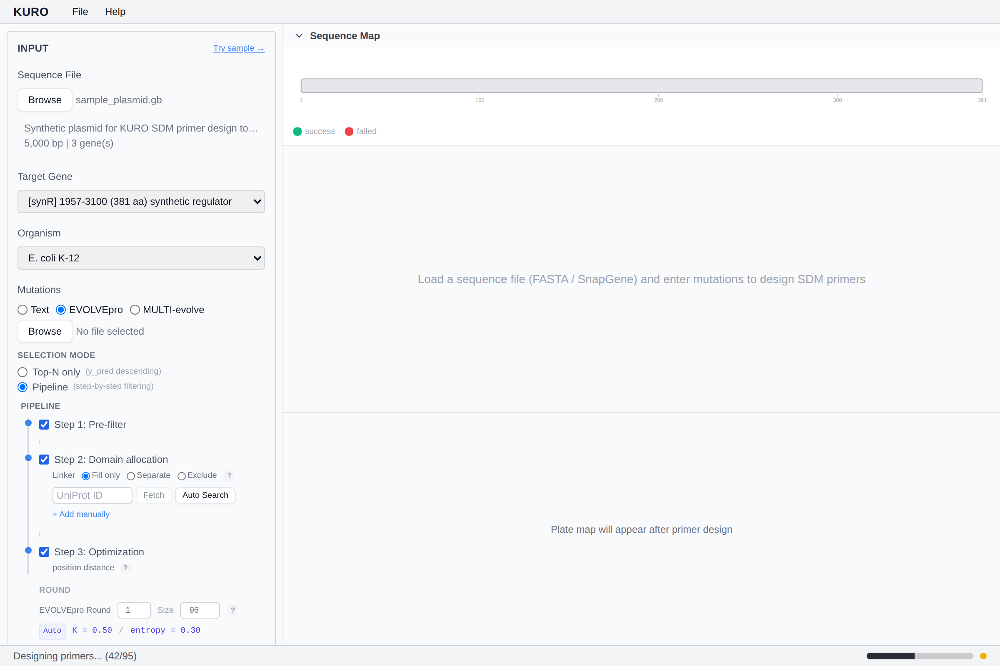
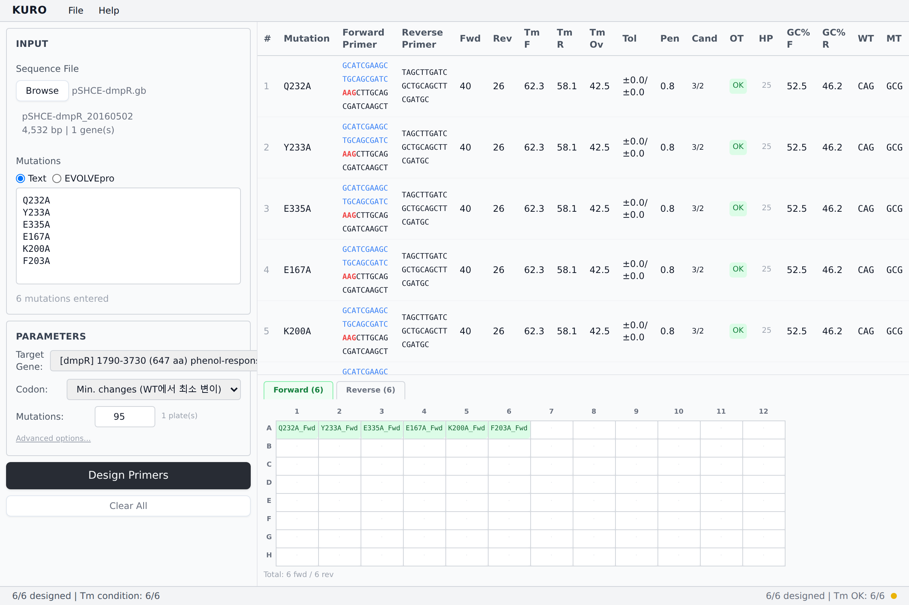

# Quick Start

Design your first primers in 5 steps.

### Step 0 — Launch

Status bar shows **Ready** when the sidecar is up.

### Step 1 — Load a sequence

Click **Browse** and choose a GenBank / SnapGene / FASTA file. KURO auto-detects the longest ORF as the CDS target.

### Step 2 — Enter mutations

Type one per line (`Q232A`), or load an EVOLVEpro CSV via **Load CSV**.

### Step 3 — Check parameters

Default polymerase Q5, codon strategy *Min. changes*, Mutations count 95. Adjust in the Parameter panel if needed.

### Step 4 — Design

Click **Design Primers**. The progress bar tracks each step.

### Step 5 — Review & export

Use File → *Export Excel* for full results, or click **Export Mapping...** on the Plate Map for Echo/JANUS input.

See [Loading Sequences](loading-sequences.md), [Entering Mutations](entering-mutations.md), [Parameter Panel](parameter-panel.md), and [Designing Primers](designing-primers.md) for depth.
