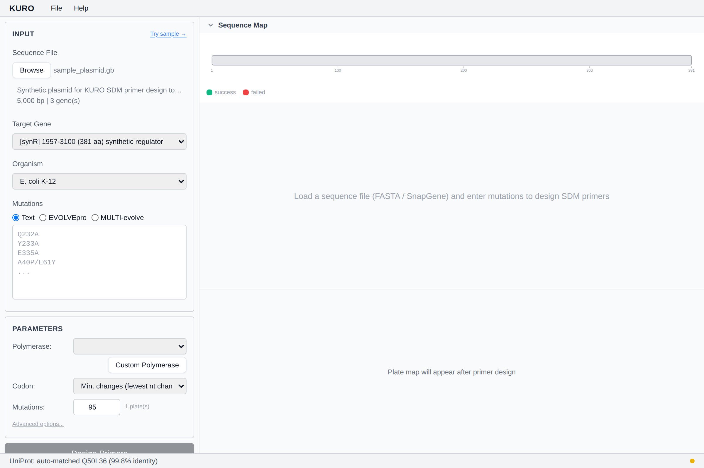

# UniProt and AlphaFold

Once a CDS is selected Kuro searches UniProt to enrich the design:

## BLAST-based match

The CDS translation is BLASTed against UniProt Swiss-Prot via EBI. The top hit is **auto-selected only if identity ≥ 95 %**; otherwise the candidate list is shown and you pick manually.

> **Contact email required.** EBI rejects BLAST jobs without an email. Configure `KURO_CONTACT_EMAIL` env or `contact_email` in `~/.kuro/config.json`. See [Configuration](configuration.md).

## Direct accession lookup

If your GenBank file has a `db_xref="UniProtKB/..."` qualifier, Kuro fetches the entry directly as the first candidate.

## Gene-name fallback

If BLAST fails, a UniProt gene-name search is tried — expect low-identity matches if the sequence is divergent.

## AlphaFold structure badge

Each candidate shows **AF** if a predicted structure exists. Selecting the candidate triggers Cα-coordinate download for 3D Pareto diversity — see [Diversity Strategies](diversity-strategies.md).

*Stub — candidate panel screenshot coming.*
