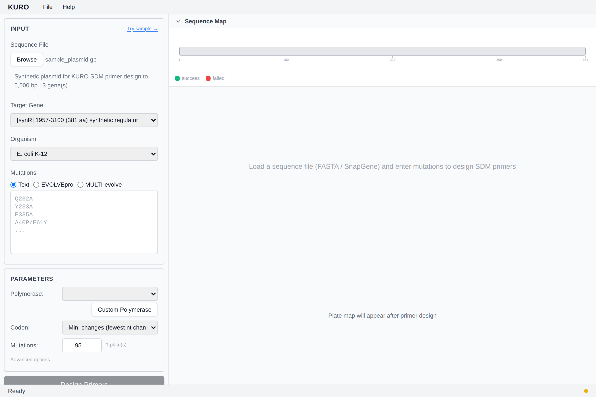

# 벤치마크 다이얼로그

알려진 fitness landscape에서 5개 선택 전략을 비교하여 실험 시스템에 맞는 최적 방식 선택.

## 열기

Help 메뉴 → *Benchmark*.

## 전략

| 이름 | 설명 |
|---|---|
| `topn` | `y_pred`만으로 정렬 |
| `random` | 균등 무작위 샘플 (baseline) |
| `pareto_1d` | Pareto on (fitness, 잔기 위치 거리) |
| `pareto_3d` | Pareto on (fitness, AlphaFold Cα 거리) |
| `pareto_entropy` | entropy 가중 fitness 기반 Pareto |

## 입력

- **Landscape CSV** (variant, fitness)
- **Ground truth CSV** (variant, fitness) — 동일 스키마, 타깃 셋
- **N select**: trial당 픽 수
- **N random trials**: random baseline 반복 횟수
- **Top percentile**: "hit"로 간주할 ground truth 상위 비율

## 출력

- 전략별 **Hit rate** (선택 variant 중 top-percentile 적중 비율)
- **Fitness coverage**
- **Position coverage**
- 막대 차트 + raw 테이블
- JSON / CSV 내보내기

*스텁 — 다이얼로그 스크린샷 추가 예정.*
