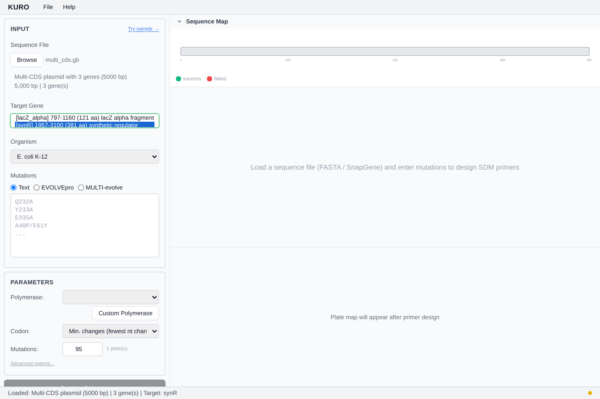

# 유전자 선택

서열 파일에 CDS feature(GenBank) 또는 ORF(FASTA)가 여러 개면 Kuro가 gene 드롭다운에 나열.

## 기본 선택

최장 ORF / 최대 아미노산 길이.

## 수동 전환

드롭다운에서 다른 유전자 선택. 전환 시:
- 변이 텍스트 초기화
- UniProt / AlphaFold 캐시 리셋
- Domain / diversity 설정 리셋
- `db_xref` 또는 translation이 있으면 UniProt 검색 자동 재실행

## 위치 번호

모든 변이 위치(`Q232A`)는 **선택된 CDS**에 대한 1-based. 유전자 전환 시 번호 체계가 재설정됨.

*스텁 — 드롭다운 스크린샷 추가 예정.*
