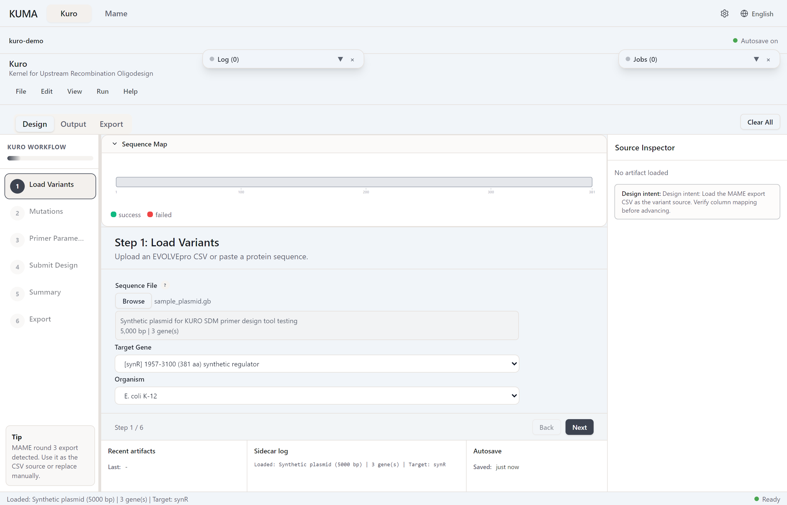

# 서열 로드

## 지원 포맷

| 확장자 | 파서 | 비고 |
|---|---|---|
| `.gb` / `.gbk` / `.gbff` | GenBank (Biopython) | CDS feature 자동 추출 |
| `.dna` | SnapGene | CDS feature 있으면 우선, 없으면 ORF 탐지 fallback |
| `.fa` / `.fasta` | FASTA | 헤더에서 유전자명/organism 추출, longest ORF 탐지 |

## GenBank 레코드

KURO와 MAME의 주석 서열 로더는 GenBank의 첫 레코드와 그 레코드의 CDS만 사용한다. 뒤쪽 레코드의 CDS는 다른 템플릿의 좌표이므로 선택 목록에 넣지 않는다. 원하는 레코드를 양쪽 flanking template과 함께 별도 GenBank 파일로 내보낸 뒤 불러온다. 첫 레코드에 CDS 주석이 없으면 뒤쪽 레코드의 주석으로 대신할 수 없다.

## CDS 자동 선택

로드 시 모든 ATG를 스캔하고 downstream ORF 길이를 계산하여 가장 긴 것을 자동 선택. 수동 전환은 Input 패널의 gene 드롭다운 — [유전자 선택](gene-selection.md).

## 0-based 인덱싱

Kuro는 0-based CDS 시작 위치 사용. SnapGene / Benchling은 1-based 표시 — 수동 입력 시 1 빼서 변환.

## 드래그 앤 드롭

서열 파일을 Kuro 창으로 드롭하면 **Browse**와 동일 파이프라인 실행.

*스텁 — 로드된 상태 스크린샷 추가 예정.*
