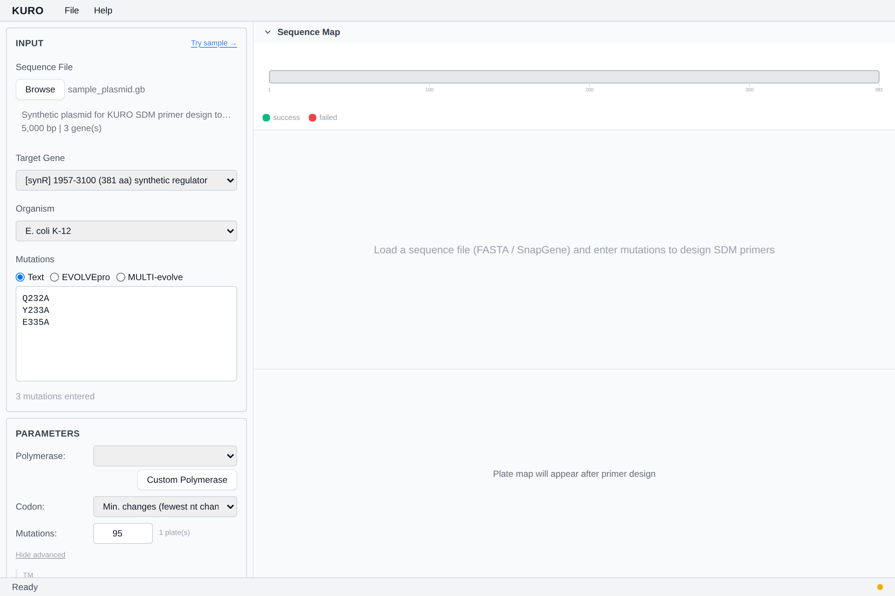

# 파라미터 패널

폴리머레이즈 프로파일, 코돈 전략, 프라이머 Tm/GC/길이 제약을 관리.

## Polymerase

기본 7개 프로파일 (Q5, KOD, Phusion, Herculase II, PfuUltra II, KAPA HiFi, Takara PrimeSTAR GXL). 선택 시 해당 프로파일의 Tm target, salt/Mg²⁺ 보정, GC 범위가 자동 로드됨.

커스텀 프로파일 — [커스텀 폴리머레이즈 에디터](custom-polymerase-editor.md).

## Codon 전략

- **Min. changes** (기본): WT 코돈에서 가장 적은 nt 변경
- **Optimal**: 선택 organism의 최다 빈도 코돈

## Mutations 수

목표 성공 설계 수. 기본 95 (플레이트 1장에서 control 제외). 기본 organism은 *E. coli* — 메뉴에서 전환 가능.

상한: 10,000 (v1.33.6+).

입력 아래에 플레이트 프리뷰 표시 (`Math.ceil(N / 96)`).

## Advanced options

- **Tm targets**: fwd / rev / overlap (°C)
- **GC 범위**: min / max (%)
- **프라이머 길이 범위**: fwd-min/max, rev-min/max — 폴리머레이즈 기본값 오버라이드
- **Fill on failure**: 실패 시 버퍼 후보로 자동 채움

*스텁 — 확장된 패널 스크린샷 추가 예정.*
