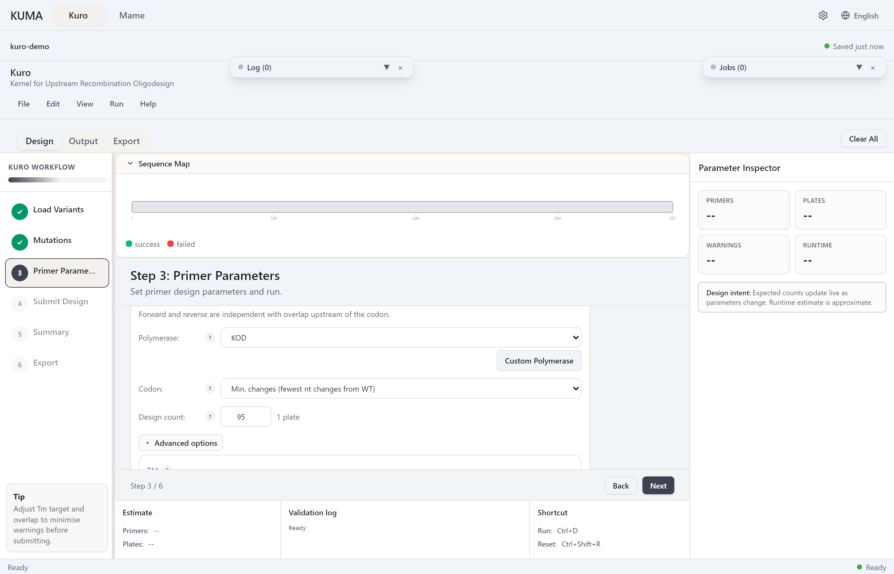

# 파라미터 패널

폴리머레이즈 프로파일과 프라이머 Tm/GC/길이 제약을 관리. 코돈 표는 여기가 아니라 서열 입력 패널의 타겟 유전자 옆 **Organism** 에서 고른다.

## Polymerase

기본 7개 프로파일 (Taq, Phusion, Q5, KOD, DreamTaq, TAKARA_GXL, Q5 SDM). 선택 시 권장 annealing temperature 규칙, GC 범위, overlap 모드가 로드됨. 설계용 Tm target은 별도로 조정 가능.

커스텀 프로파일 — [커스텀 폴리머레이즈 에디터](custom-polymerase-editor.md).

## 코돈 선택

고를 전략 값은 없다. 여기 있던 select 는 v0.16.60 에서 빠졌다. 두 값이 같은 후보 집합을 순서만 바꿔 냈고 엔진이 그 순서를 penalty 로 다시 정렬했기 때문이다.

지금은 타겟 아미노산의 동의 코돈 전부가 경쟁한다. WT 코돈과 선택한 organism 이 그 아미노산의 10% 미만으로 쓰는 코돈이 빠진다. 남은 후보를 설계 penalty 가 WT 대비 염기 변경 수(1/2/3 변경에 0/2/4)와 사용빈도(4.0 x (1 - usage fraction))로 Tm·GC 와 함께 점수 매긴다. 코돈에 영향을 주는 사용자 입력은 organism 하나다.

내장 코돈 표는 5종이고 다른 균주는 사용자가 설치한다. [설정](configuration.md) 참고.

## Mutations 수

목표 성공 설계 수. 기본 95 (플레이트 1장에서 control 제외). organism 기본값은 *E. coli* 이고 서열 입력 패널의 **Organism** 드롭다운에서 바꾼다.

상한: 10,000 (v1.33.6+).

입력 아래에 플레이트 프리뷰 표시 (`Math.ceil(N / 96)`).

## Advanced options

- **Tm targets**: fwd / rev / overlap (°C)
- **GC 범위**: min / max (%)
- **프라이머 길이 범위**: fwd-min/max, rev-min/max — 폴리머레이즈 기본값 오버라이드
- **Fill on failure**: 실패 시 버퍼 후보로 자동 채움
