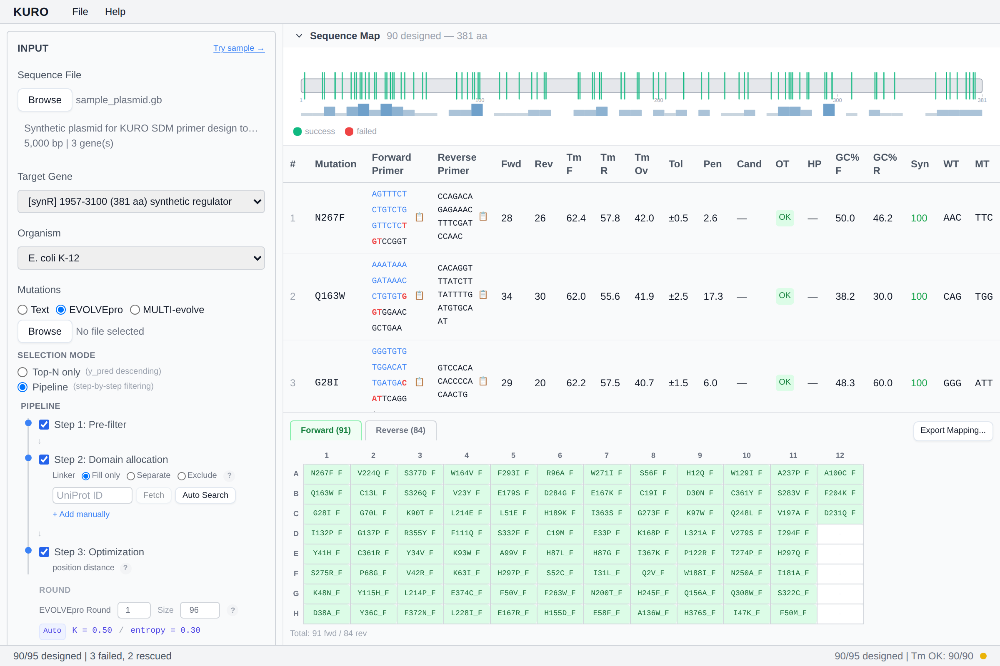

# 결과 테이블

변이별 프라이머 쌍 + QC 통계를 한 행에 표시.

## 컬럼

| 컬럼 | 의미 |
|---|---|
| Mutation | 예: `Q232A` |
| y_pred | EVOLVEpro 점수 (EVOLVEpro 모드에서만) |
| Fwd | Forward 프라이머 (클릭 → 후보 popover) |
| Tm F | Forward Tm (°C) |
| GC F | Forward GC % |
| Len F | Forward 길이 |
| HP F | Hairpin ΔG 배지 (녹색 / 주황 / 빨강) |
| Rev | Reverse 프라이머 |
| Tm R | Reverse Tm |
| GC R | Reverse GC % |
| Len R | Reverse 길이 |
| HP R | Reverse hairpin 배지 |
| Overlap | Overlap Tm |
| Note | 경고 / rescue 정보 |

## 정렬

컬럼 헤더 클릭. 기본 정렬: 입력 순서. 자주 쓰는 정렬: 변이 위치(자연 정렬), y_pred 내림차순, Tm 차이.

## Popover

- **Fwd / Rev 셀 클릭** → 상위 10개 후보 비교 popover ([후보 교체](candidate-swap.md))
- **HP 배지 클릭** → hairpin / homodimer / heterodimer ΔG 세부

## 실패 행

배경 빨강, 프라이머 셀 비어있음, Note 컬럼에 사유. **Retry** 사용 ([실패 재시도](failed-retry.md)).

*스텁 — 테이블·popover 스크린샷 추가 예정.*
