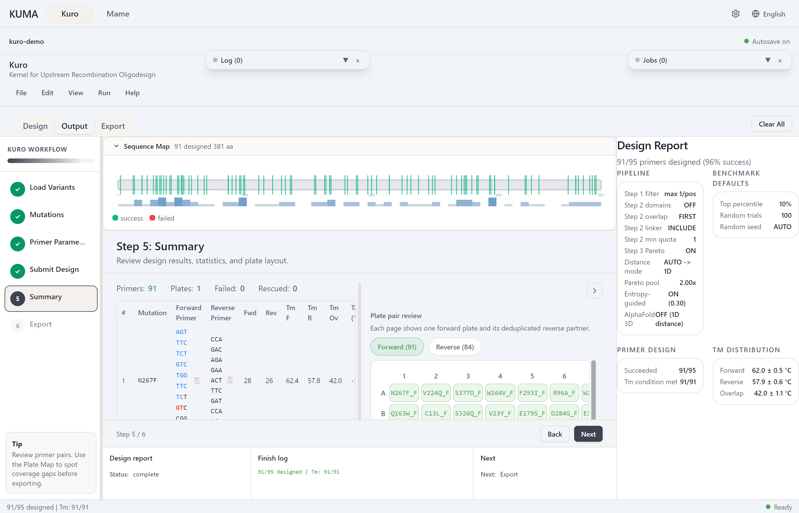

# 결과 테이블

변이별 프라이머 쌍 + QC 통계를 한 행에 표시.

## 컬럼

| 컬럼 | 의미 |
|---|---|
| Mutation | 예: `Q232A` |
| y_pred | EVOLVEpro 점수 (EVOLVEpro 모드에서만) |
| Fwd | Forward 프라이머 (클릭 → 후보 popover) |
| Tm F | Forward Tm (°C) |
| GC F | Forward GC % |
| Len F | Forward 길이 |
| HP F | Hairpin ΔG 배지 (녹색 / 주황 / 빨강) |
| Rev | Reverse 프라이머 |
| Tm R | Reverse Tm |
| GC R | Reverse GC % |
| Len R | Reverse 길이 |
| HP R | Reverse hairpin 배지 |
| Overlap | Overlap Tm |
| Note | 경고 / rescue 정보 |

## 정렬

컬럼 헤더 클릭. 기본 정렬: 입력 순서. 자주 쓰는 정렬: 변이 위치(자연 정렬), y_pred 내림차순, Tm 차이.

## Popover

- **Fwd / Rev 셀 클릭** → 상위 10개 후보 비교 popover ([후보 교체](candidate-swap.md))
- **HP 배지 클릭** → 4행 세부: hairpin ΔG(forward, reverse)와 homodimer ΔG(forward, reverse). heterodimer(fwd×rev) 행은 없음, Kuro의 fwd/rev 프라이머는 Gibson overlap을 공유하도록 설계되어 서로 5' 대 5'로 상보하고 양쪽 3' 말단이 유리(dangling)된 구조라, polymerase가 연장할 수 없어 primer-dimer 산물이 되지 않는다 (Kwok et al. 1990, NAR 18(4):999-1005, PMID 2179874, sdm_engine.py에 이미 인용된 extendability 기준과 일치).
- **주황 배지** = 엔진이 해당 프라이머 쌍의 구조를 경고로 판정. hairpin은 쌍의 권장 어닐링 온도에서 이상태(two-state) folded fraction이 10%를 넘으면 경고(프로파일에 Ta 규칙이 없으면 60 °C fallback), homodimer는 Tm이 40 °C를 넘으면 경고. 같은 판정이 세부 popover의 상태 컬럼에도 적용된다. 플래그가 없는 구조(플래그 도입 전에 직렬화된 행이나 역전파로 쌍의 Ta 를 알 수 없어 비워진 hairpin 플래그)는 그 구조에 한해 legacy 판정인 Tm > 40 °C 로 되돌아간다. Tm 이 높은 구조가 무경고로 보이지 않게 하려는 것이다.

## 실패 행

배경 빨강, 프라이머 셀 비어있음, Note 컬럼에 사유. **Retry** 사용 ([실패 재시도](failed-retry.md)).
